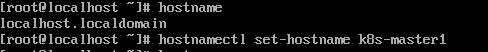

### 使用kubeadm安装集群

------

#### 搭建Kubernetes集群的必要条件

- Ubuntu 20.04.1 LTS
- containerd 1.4.3
- 2 GB or more of RAM per machine (any less will leave little room for your apps)
- 2 CPUs or more
- Full network connectivity between all machines in the cluster (public or private network is fine)
- Unique hostname, MAC address, and product_uuid for every node. See [here](https://v1-18.docs.kubernetes.io/docs/setup/production-environment/tools/kubeadm/install-kubeadm/#verify-mac-address) for more details.
- Certain ports are open on your machines. See [here](https://v1-18.docs.kubernetes.io/docs/setup/production-environment/tools/kubeadm/install-kubeadm/#check-required-ports) for more details.
- Swap disabled. You **MUST** disable swap in order for the kubelet to work properly.


#### 一、新建Linux虚拟机（1 master node + 1 worker node)

1. 安装 VirtualBox 6.1.16， 下载链接 https://download.virtualbox.org/virtualbox/6.1.16/VirtualBox-6.1.16-140961-Win.exe

2. Ubuntu 20.04.1 LTS 镜像，下载链接：https://mirrors.gigenet.com/ubuntu/20.04.1/ubuntu-20.04.1-desktop-amd64.iso

3. 新建虚拟机（master node），虚拟机最低要求：
   - 2G内存
   - 2核CPU
   - 30G虚拟硬盘

   
   
4. 虚拟机网络选择”网络地址转换（NAT）“模式和“仅主机(Host-Only)网络”

   

   

   

5. 导入Ubuntu镜像，开始安装。

   

   选择最小化安装模式。

   

6. 为Ubuntu安装增强功能（可以调整屏幕大小）

   1. 单击“Devices” -> "Insert Guest Additions CD image..."，安装增强功能

   

   2. 在Ubuntu中打开Terminal，重启Ubuntu，完成安装。

      ```shell
      reboot
      ```
   
7. 检查hostname，保证master node和worker node之间hostname的唯一性。可以通过指令`hostnamectl set-hostname <newhostname>`修改机器的hostname。




8. 查询Host-Only网卡的IP地址，

   ```shell
   cainzhong@ubuntu-k8s-master1:~$ ip addr
   1: lo: <LOOPBACK,UP,LOWER_UP> mtu 65536 qdisc noqueue state UNKNOWN group default qlen 1000
       link/loopback 00:00:00:00:00:00 brd 00:00:00:00:00:00
       inet 127.0.0.1/8 scope host lo
          valid_lft forever preferred_lft forever
       inet6 ::1/128 scope host 
          valid_lft forever preferred_lft forever
   # NAT网卡
   2: enp0s3: <BROADCAST,MULTICAST,UP,LOWER_UP> mtu 1500 qdisc fq_codel state UP group default qlen 1000
       link/ether 08:00:27:19:c3:6b brd ff:ff:ff:ff:ff:ff
       inet 10.0.2.15/24 brd 10.0.2.255 scope global dynamic noprefixroute enp0s3
          valid_lft 86282sec preferred_lft 86282sec
       inet6 fe80::2322:360b:9e50:5d2c/64 scope link noprefixroute 
          valid_lft forever preferred_lft forever
   # Host-Only网卡
   3: enp0s8: <BROADCAST,MULTICAST,UP,LOWER_UP> mtu 1500 qdisc fq_codel state UP group default qlen 1000
       link/ether 08:00:27:31:bc:12 brd ff:ff:ff:ff:ff:ff
       inet 192.168.56.103/24 brd 192.168.56.255 scope global dynamic noprefixroute enp0s8
          valid_lft 482sec preferred_lft 482sec
       inet6 fe80::a87:e9e:e1b2:f987/64 scope link noprefixroute 
          valid_lft forever preferred_lft forever
   ```

   并在`/etc/hosts`文件中添加一条记录，如下图所示。

   ```shell
   sudo nano /etc/hosts
   ```

   

   | IP地址         | Hostname           |                                           |
   | -------------- | ------------------ | ----------------------------------------- |
   | 192.168.56.103 | ubuntu-k8s-master1 | Host-Only网卡的IP地址，用于集群间的通信。 |
   | 192.168.56.104 | ubuntu-k8s-node1   | Host-Only网卡的IP地址，用于集群间的通信。 |
   |                |                    |                                           |

   > 参考资料：
   >
   > https://linuxize.com/post/how-to-configure-static-ip-address-on-ubuntu-18-04/

9. [可选] 在公司网络或VPN环境下，如何正确配置DNS和docker proxy？

   1. 如果在公司网络下，公司会有自己的http_proxy地址，这个地址可能不能被`114.114.114.114`正常解析。需要配置公司的DNS Server地址。如果是使用Pulse Secure软件连接公司VPN网络的，首先找到对应的网卡设备，然后按下图方式找到对应的DNS Server地址。例如：`15.122.222.54`

   ##### 

   2. 将`15.122.222.54`写入虚拟机NAT网卡的配置文件中。（每台虚拟机进行同样的操作）

      ```yaml
      # 修改NAT网卡的配置信息
      cat << EOF | sudo tee  /etc/netplan/01-network-manager-all.yaml
      # Let NetworkManager manage all devices on this system
      network:
        version: 2
        renderer: NetworkManager
        ethernets:
          enp0s3:
            dhcp4: no
            addresses:
              - 10.0.2.15/24
            gateway4: 10.0.2.2
            nameservers:
              addresses: [15.122.222.54, 8.8.8.8]
          enp0s8:
            dhcp4: no
            addresses:
              - 192.168.56.103/24
      EOF
      ```

      ```shell
      # 重启网络服务
      sudo netplan apply
      ```

   3. 通过GUI的方式设置Proxy。Settings -> Network.

      

   4. 配置docker proxy

      ```shell
      # Set docker proxy
      # To enable the service, run the systemctl enable docker.service command.
      systemctl enable docker.service
      mkdir -p /usr/lib/systemd/system/docker.service.d
      cat << EOF > /usr/lib/systemd/system/docker.service.d/http_proxy.conf
      [Service]
      Environment="HTTP_PROXY=http://web-proxy.houston.softwaregrp.net:8080" "HTTPS_PROXY=http://web-proxy.houston.softwaregrp.net:8080"
      EOF
      
      # You need to configure another proxy when you set the Docker-Content-Trust on. Run the following commands:
      # export http_proxy=http://web-proxy.houston.softwaregrp.net:8080
      # export https_proxy=http://web-proxy.houston.softwaregrp.net:8080
      
      # Run the systemctl daemon-reload command to reload the configuration.
      systemctl daemon-reload
      # Run the service docker restart command to restart docker.
      service docker restart
      # Run the docker pull hello-world command to check if you can pull images from Docker Hub.
      docker pull hello-world
      ```

10. 至此，虚拟机通过NAT网卡可以访问外网（互联网），虚拟机通过Host-Only网卡可以访问物理机。但是物理机还不能通过Host-Only网卡访问虚拟机，需要在Ubuntu上开启SSH Server。

    ```shell
    sudo apt update
    sudo apt install openssh-server
    sudo systemctl status ssh
    # 通过Host-Only网卡连接Ubuntu, E.g. ssh cainzhong@192.168.56.103
    ```

    **故障排查：**

    问题描述：sudo apt update always giving Clearsigned file isn't valid, got 'NOSPLIT' (does the network require authentication?)

    解决方案：I had the same issue. It turns out that apt-get uses `/etc/apt/apt.conf` for the proxy settings (my browser settings are already set). Making `apt.conf` match my browser proxy settings solved the problem.

    ```shell
    gedit /etc/apt/apt.conf  # 没有此文件，则新建文件
    
    Acquire::http::proxy "http://web-proxy.houston.softwaregrp.net:8080";
    Acquire::https::proxy "http://web-proxy.houston.softwaregrp.net:8080";
    # Acquire::ftp::proxy "ftp://<proxy>";
    # Acquire::socks::proxy "socks:<proxy>";
    ```

    > 参考资料：
    >
    > https://linuxize.com/post/how-to-enable-ssh-on-ubuntu-18-04/
    >
    > https://askubuntu.com/questions/899009/sudo-apt-update-always-giving-clearsigned-file-isnt-valid-got-nosplit-does

11. 在Ubuntu中启用root账号。

    ```shell
    # You will be prompted to enter and confirm the new root password:
    sudo passwd root
    # Switch to root user
    su -
    ```

    > 参考资料：
    >
    > [How to Enable and Disable Root User Account in Ubuntu](https://linuxize.com/post/how-to-enable-and-disable-root-user-account-in-ubuntu/#:~:text=To enable root account in,That's it!)

12. Setup SFTP server on Ubuntu

    ```shell
    sudo apt install ssh
    ```

    ```shell
    vim /etc/ssh/sshd_config
    # Scroll to the bottom of the file and add the following 5 lines at the very end:
    Match group sftp
    ChrootDirectory /home
    X11Forwarding no
    AllowTcpForwarding no
    ForceCommand internal-sftp
    # The lines above will allow users in the sftp group to access their home directories via SFTP, but denies them normal SSH access, so they can never access a shell. After pasting those lines, save and close the configuration file.
    sudo systemctl restart ssh
    ```

    ```shell
    # Create a new user group called sftp. All of our SFTP users will need to belong to this group.
    sudo addgroup sftp
    # Create a new user. We'll simply call ours sftpuser in this example. Also be sure to add this user to the sftp group.
    udo useradd -m sftpuser -g sftp
    # Set a password for the newly created sftpuser:
    sudo passwd sftpuser
    # Grant full access
    sudo chmod 700 /home/sftpuser/
    # 可以使用Xftp工具，将Windows机器上的文件传输到Ubuntu机器的/home/sftpuser/
    ```

    > 参考资料：
    >
    > https://linuxconfig.org/how-to-setup-sftp-server-on-ubuntu-20-04-focal-fossa-linux

13. 以相同的方式创建其余的虚拟机。

14. 整个k8s集群的网络拓扑结构，参见下图：

| Host Name   | NAT IP Addr for Internet Connection  | Host-Only Network IP Addr for K8s Cluster Connection |
| ----------- | ------------------------------------ | ---------------------------------------------------- |
| k8s-master1 | 10.0.2.15/24      (GATEWAY 10.0.2.2) | 192.168.56.103/24                                    |
| k8s-node1   | 10.0.2.15/24      (GATEWAY 10.0.2.2) | 192.168.56.104/24                                    |
|             |                                      |                                                      |

##### VirtualBox 网络模式总结

| 网络模式            | 解释                                                         |
| :------------------ | :----------------------------------------------------------- |
| 网络地址转换（NAT） | NAT 协议通过具有公网 ip 的 host 主机作为代理， 实现了无公网 ip 的 guest 虚拟机的互联网访问需求 |
| NAT 网络            | 本质上也是 NAT，不同的是这种模式下不支持 host 和 guest 主机之间的端口转发 |
| 桥接网卡            | 桥接有点类似物理设备中的交换机， 通过它，guest 虚拟机可以和 host 主机在链路层互联，构成一个局域网； 这样的话，guest 虚拟机由于加入了 host 主机所在的物理局域网会由 DHCP 自动分配到一个 ip |
| 内部网络            | 在这种模式下，VirtualBox 会生成一个虚拟局域网供虚拟机集群使用； 虚拟机间可以相互通信，但 host 主机无法与虚拟机进行通信 |
| host-only 模式      | guest 虚拟机通过 host 上的虚拟网卡与 host 主机处于同一局域网中， guest 和 host 可以相互通信，但 guest 虚拟机无法访问外网 |

> 参考资料：
>
> [VirtualBox 网络模式总结](https://rqsir.github.io/2019/05/23/VirtualBox-%E7%BD%91%E7%BB%9C%E6%A8%A1%E5%BC%8F%E6%80%BB%E7%BB%93/)

#### 二、安装containerd（所有机器）

1. 在所有虚拟机上（master node + worker node)上安装containerd。

   ```shell
   # Set proxy
   # export http_proxy=http://web-proxy.houston.softwaregrp.net:8080
   # export https_proxy=http://web-proxy.houston.softwaregrp.net:8080
   
   # Add repositories
   # echo "deb http://mirrors.163.com/ubuntu/ bionic main restricted universe multiverse" | tee /etc/apt/sources.list.d/163.list
   
   ### Install packages to allow apt to use a repository over HTTPS
sudo apt-get update && sudo apt install -y vim apt-transport-https ca-certificates curl software-properties-common
   
   ## Add Docker's official GPG key
   curl -fsSL https://download.docker.com/linux/ubuntu/gpg | sudo apt-key --keyring /etc/apt/trusted.gpg.d/docker.gpg add -
   
   # Add the Kubernetes repository and the key to verify that everything is installed securely.
   curl -s https://packages.cloud.google.com/apt/doc/apt-key.gpg | apt-key add -
   
   ## Add Docker apt repository.
   sudo add-apt-repository "deb [arch=amd64] https://download.docker.com/linux/ubuntu $(lsb_release -cs) stable"
       
   ## Install containerd
   sudo apt-get update && sudo apt-get install -y containerd.io
   
   # Configure containerd
   sudo mkdir -p /etc/containerd
   sudo containerd config default | sudo tee /etc/containerd/config.toml
   
   # Restart containerd
   sudo systemctl restart containerd
   ```

2. 设置containerd

This section contains the necessary steps to use `containerd` as CRI runtime.

```shell
cat <<EOF | sudo tee /etc/modules-load.d/containerd.conf
overlay
br_netfilter
EOF

# Configure Firewall
# We configure iptables to allow traffic across the network bridge. This change is vital because iptables (the servers default firewall) should always examine what traffic passes over the connections. Now we will load the *br_netfilter* add-on module.
sudo modprobe overlay
sudo modprobe br_netfilter
# Ensure that the *br_netfilter* module is loaded using the following command.
lsmod | grep br_netfilter
# The *br_netfilter* kernel module is needed to enable bridged traffic between the Kubernetes pods across the cluster. It allows members of the cluster to appear as if directly connected to each other.

# Setup required sysctl params, these persist across reboots.
cat <<EOF | sudo tee /etc/sysctl.d/99-kubernetes-cri.conf
net.bridge.bridge-nf-call-iptables  = 1
net.ipv4.ip_forward                 = 1
net.bridge.bridge-nf-call-ip6tables = 1
EOF

# Apply sysctl params without reboot
sudo sysctl --system

# Configure containerd proxy
mkdir -p /etc/systemd/system/containerd.service.d
cat <<EOF >/etc/systemd/system/containerd.service.d/http-proxy.conf    
[Service]    
Environment="HTTP_PROXY=http://web-proxy.houston.softwaregrp.net:8080"    
Environment="HTTPS_PROXY=http://web-proxy.houston.softwaregrp.net:8080"    
Environment="NO_PROXY=127.0.0.0/8,10.0.0.0/16,10.244.0.0/16,172.17.0.0/16,192.168.0.0/16"    
EOF

# Reload the systemd configuration
systemctl daemon-reload
# Restart containerd
systemctl restart containerd
```

> 参考资料：
>
> https://github.com/kubernetes-sigs/kind/issues/688

##### systemd

To use the `systemd` cgroup driver in `/etc/containerd/config.toml` with `runc`, set

```
[plugins."io.containerd.grpc.v1.cri".containerd.runtimes.runc]
  ...
  [plugins."io.containerd.grpc.v1.cri".containerd.runtimes.runc.options]
    SystemdCgroup = true
```


> 参考资料：
>
> https://containerd.io/docs/getting-started/
>
> https://medium.com/@Mark.io/getting-started-with-containerd-188b7256c20a

#### 三、设置k8s环境准备条件（所有机器）

##### Disable Swap Memory

For kubelet to work correctly, it is essential to disable SWAP memory. This change is applied to each server. The hard drive’s paging space is used to temporarily store data when there is not enough space in RAM. We accomplish this using the following commands.

```shell
sed -i '/ swap / s/^\(.*\)$/#\1/g' /etc/fstab
swapoff -a
```

#### 四、安装k8s (master node)

##### Install kubelet kubeadm kubectl

```shell
# Add repositories
echo "deb https://apt.kubernetes.io/ kubernetes-xenial main" | tee /etc/apt/sources.list.d/kubernetes.list
apt update
apt -y install kubelet kubeadm kubectl
# Verify Installation
kubectl version --client && kubeadm version
```

##### 设置Kubelet

```shell
# Configure Kubelet to use containerd
sudo mkdir -p  /etc/systemd/system/kubelet.service.d/
cat << EOF | sudo tee  /etc/systemd/system/kubelet.service.d/0-containerd.conf
[Service]                                                 
Environment="KUBELET_EXTRA_ARGS=--container-runtime=remote --runtime-request-timeout=15m --container-runtime-endpoint=unix:///run/containerd/containerd.sock"
EOF
```

##### 设置CNI网络

```shell
mkdir -p /etc/cni/net.d
cat >/etc/cni/net.d/10-mynet.conf <<EOF
{
  "cniVersion": "0.2.0",
  "name": "mynet",
  "type": "bridge",
  "bridge": "cni0",
  "isGateway": true,
  "ipMasq": true,
  "ipam": {
    "type": "host-local",
    "subnet": "10.244.0.0/16",
    "routes": [
      { "dst": "0.0.0.0/0" }
    ]
  }
}
EOF
```

> 参考资料：
>
> https://github.com/containernetworking/cni#how-do-i-use-cni

##### 初始化k8s

```shell
# Pull the necessary containers images
kubeadm config images pull

crictl --runtime-endpoint /run/containerd/containerd.sock images

# export no_proxy='192.168.56.0/24,10.244.0.0/16,10.96.0.0/12'

kubeadm init --config=./kubeletcfg.yaml

# Performs a best effort revert of changes made to this host by 'kubeadm init' or 'kubeadm join'
# kubeadm reset
```

```yaml
# kubeletcfg.yaml
--- 
apiVersion: kubeadm.k8s.io/v1beta2
kind: InitConfiguration
nodeRegistration: 
  criSocket: /var/run/containerd/containerd.sock
  kubeletExtraArgs: 
    cgroup-driver: systemd
    container-runtime: remote
    container-runtime-endpoint: "unix:///run/containerd/containerd.sock"
    kubelet-cgroups: /systemd/system.slice
    runtime-cgroups: /system.slice/containerd.service
---
apiVersion: kubelet.config.k8s.io/v1beta1
kind: KubeletConfiguration
cgroupDriver: containerd
---
apiVersion: kubeadm.k8s.io/v1beta2
kind: ClusterConfiguration
networking:
  podSubnet: "10.244.0.0/16" # --pod-network-cidr
controlPlaneEndpoint: "192.168.56.103:6443"
apiServer:
  certSANs:
    - "192.168.56.103"
  extraArgs:
    # 非常重要！需设置为worker node可以访问的master node ip。
    advertise-address: "192.168.56.103"
```

> 参考资料：
>
> https://kubernetes.io/docs/setup/production-environment/tools/kubeadm/control-plane-flags/
>
> https://godoc.org/k8s.io/kubernetes/cmd/kubeadm/app/apis/kubeadm/v1beta1

`kubeadm init --config=./kubeletcfg.yaml`命令执行时会卡在以下页面：

```
[init] Using Kubernetes version: v1.20.2
[preflight] Running pre-flight checks
[preflight] Pulling images required for setting up a Kubernetes cluster
[preflight] This might take a minute or two, depending on the speed of your internet connection
[preflight] You can also perform this action in beforehand using 'kubeadm config images pull'
....
[wait-control-plane] Waiting for the kubelet to boot up the control plane as static Pods from directory "/etc/kubernetes/manifests". This can take up to 4m0s
```

大概需要4分钟，请耐心等待。

k8s初始化完成后，会有一些提示信息，按照提示操作即可。

以下命令用于配置`kubectl`

```shell
To start using your cluster, you need to run the following as a regular user:

  mkdir -p $HOME/.kube
  sudo cp -i /etc/kubernetes/admin.conf $HOME/.kube/config
  sudo chown $(id -u):$(id -g) $HOME/.kube/config

Alternatively, if you are the root user, you can run:

  export KUBECONFIG=/etc/kubernetes/admin.conf

You should now deploy a pod network to the cluster.
Run "kubectl apply -f [podnetwork].yaml" with one of the options listed at:
  https://kubernetes.io/docs/concepts/cluster-administration/addons/

Then you can join any number of worker nodes by running the following on each as root:

kubeadm join 192.168.56.103:6443 --token vudyv7.10ioaj0fao07w28z \
    --discovery-token-ca-cert-hash sha256:a643f791b2c45ac6efb5c1575f23d8891f26ca8559517a08651fb9599770eb76 

```

如果忘记了，可以使用如下命令重新获取。

```shell
kubeadm token create --print-join-command 
```

以上，安装master节点完毕。可以使用`kubectl get nodes`查看一下。

```shell
root@ubuntu-k8s-master1:~# kubectl get node -o wide
NAME                 STATUS   ROLES                  AGE   VERSION   INTERNAL-IP      EXTERNAL-IP   OS-IMAGE             KERNEL-VERSION     CONTAINER-RUNTIME
ubuntu-k8s-master1   Ready    control-plane,master   16m   v1.20.2   192.168.56.103   <none>        Ubuntu 20.04.1 LTS   5.8.0-38-generic   containerd://1.4.3
```

#### 五、安装k8s (worker node)

1. 在所有k8s worker node上安装kubelet、kubeadm、kubectl。

   ```shell
   # Add repositories
   echo "deb https://apt.kubernetes.io/ kubernetes-xenial main" | tee /etc/apt/sources.list.d/kubernetes.list
   apt update
   apt -y install kubelet kubeadm kubectl
   # Verify Installation
   kubectl version --client && kubeadm version
   
   # sudo apt-key adv --keyserver keyserver.ubuntu.com --recv-keys 6A030B21BA07F4FB 8B57C5C2836F4BEB
   ```
   
2. 设置Kubelet

   ```shell
# Configure Kubelet to use containerd
   sudo mkdir -p  /etc/systemd/system/kubelet.service.d/
   cat << EOF | sudo tee  /etc/systemd/system/kubelet.service.d/0-containerd.conf
   [Service]                                                 
   Environment="KUBELET_EXTRA_ARGS=--container-runtime=remote --runtime-request-timeout=15m --container-runtime-endpoint=unix:///run/containerd/containerd.sock"
EOF
   ```
   
3. 加入集群

   这里加入集群的命令每个人都不一样，可以登录master节点，使用`kubeadm token create --print-join-command` 来获取。

   ```shell
   kubeadm join 192.168.56.103:6443 --token vudyv7.10ioaj0fao07w28z \
       --discovery-token-ca-cert-hash sha256:a643f791b2c45ac6efb5c1575f23d8891f26ca8559517a08651fb9599770eb76
   ```

   加入成功后，可以在master节点上使用`kubectl get nodes`命令查看节点信息。

#### 六、安装flannel

因为我用的`VirtualBox`虚拟化出了两台 ubuntu 主机搭建的 k8s。在组网的过程中，我采用了双网卡方案，网卡1使用NAT地址转换用来访问互联网，网卡2使用`Host-Only`来实现虚拟机互相访问。`flannel`默认使用了网卡1的 ip 地址，而网卡1的NAT地址转换是无法访问其他虚拟机的，从而导致无法跨Node通信。

所以我们需要使用`--iface`参数手动指定它使用网卡2来进行通信，这就需要修改`kube-flannel.yml`。

```yaml
apiVersion: apps/v1
kind: DaemonSet
metadata:
  name: kube-flannel-ds
  namespace: kube-system
  ...
spec:
  ...
  template:
    ...
    spec:
      ...
      containers:
      - name: kube-flannel
        image: quay.io/coreos/flannel:v0.13.1-rc1
        command:
        - /opt/bin/flanneld
        args:
        - --ip-masq
        - --kube-subnet-mgr
        # 添加这行
        - --iface=enp0s8
```


```shell
kubectl apply -f kube-flannel.yml
# kubectl apply -f https://raw.githubusercontent.com/coreos/flannel/master/Documentation/kube-flannel.yml
```

```yaml
---
# apiVersion: policy/v1beta1
# kind: PodSecurityPolicy
# metadata:
#   name: psp.flannel.unprivileged
#   annotations:
#     seccomp.security.alpha.kubernetes.io/allowedProfileNames: docker/default
#     seccomp.security.alpha.kubernetes.io/defaultProfileName: docker/default
#     apparmor.security.beta.kubernetes.io/allowedProfileNames: runtime/default
#     apparmor.security.beta.kubernetes.io/defaultProfileName: runtime/default
# spec:
#   privileged: false
#   volumes:
#   - configMap
#   - secret
#   - emptyDir
#   - hostPath
#   allowedHostPaths:
#   - pathPrefix: "/etc/cni/net.d"
#   - pathPrefix: "/etc/kube-flannel"
#   - pathPrefix: "/run/flannel"
#   readOnlyRootFilesystem: false
#   # Users and groups
#   runAsUser:
#     rule: RunAsAny
#   supplementalGroups:
#     rule: RunAsAny
#   fsGroup:
#     rule: RunAsAny
#   # Privilege Escalation
#   allowPrivilegeEscalation: false
#   defaultAllowPrivilegeEscalation: false
#   # Capabilities
#   allowedCapabilities: ['NET_ADMIN', 'NET_RAW']
#   defaultAddCapabilities: []
#   requiredDropCapabilities: []
#   # Host namespaces
#   hostPID: false
#   hostIPC: false
#   hostNetwork: true
#   hostPorts:
#   - min: 0
#     max: 65535
#   # SELinux
#   seLinux:
#     # SELinux is unused in CaaSP
#     rule: 'RunAsAny'
---
kind: ClusterRole
apiVersion: rbac.authorization.k8s.io/v1
metadata:
  name: flannel
rules:
- apiGroups: ['extensions']
  resources: ['podsecuritypolicies']
  verbs: ['use']
  resourceNames: ['psp.flannel.unprivileged']
- apiGroups:
  - ""
  resources:
  - pods
  verbs:
  - get
- apiGroups:
  - ""
  resources:
  - nodes
  verbs:
  - list
  - watch
- apiGroups:
  - ""
  resources:
  - nodes/status
  verbs:
  - patch
---
kind: ClusterRoleBinding
apiVersion: rbac.authorization.k8s.io/v1
metadata:
  name: flannel
roleRef:
  apiGroup: rbac.authorization.k8s.io
  kind: ClusterRole
  name: flannel
subjects:
- kind: ServiceAccount
  name: flannel
  namespace: kube-system
---
apiVersion: v1
kind: ServiceAccount
metadata:
  name: flannel
  namespace: kube-system
---
kind: ConfigMap
apiVersion: v1
metadata:
  name: kube-flannel-cfg
  namespace: kube-system
  labels:
    tier: node
    app: flannel
data:
  cni-conf.json: |
    {
      "name": "cbr0",
      "cniVersion": "0.3.1",
      "plugins": [
        {
          "type": "flannel",
          "delegate": {
            "hairpinMode": true,
            "isDefaultGateway": true
          }
        },
        {
          "type": "portmap",
          "capabilities": {
            "portMappings": true
          }
        }
      ]
    }
  net-conf.json: |
    {
      "Network": "10.244.0.0/16",
      "Backend": {
        "Type": "vxlan"
      }
    }
---
apiVersion: apps/v1
kind: DaemonSet
metadata:
  name: kube-flannel-ds
  namespace: kube-system
  labels:
    tier: node
    app: flannel
spec:
  selector:
    matchLabels:
      app: flannel
  template:
    metadata:
      labels:
        tier: node
        app: flannel
    spec:
      affinity:
        nodeAffinity:
          requiredDuringSchedulingIgnoredDuringExecution:
            nodeSelectorTerms:
            - matchExpressions:
              - key: kubernetes.io/os
                operator: In
                values:
                - linux
      hostNetwork: true
      priorityClassName: system-node-critical
      tolerations:
      - operator: Exists
        effect: NoSchedule
      serviceAccountName: flannel
      initContainers:
      - name: install-cni
        image: quay.io/coreos/flannel:v0.13.1-rc1
        command:
        - cp
        args:
        - -f
        - /etc/kube-flannel/cni-conf.json
        - /etc/cni/net.d/10-flannel.conflist
        volumeMounts:
        - name: cni
          mountPath: /etc/cni/net.d
        - name: flannel-cfg
          mountPath: /etc/kube-flannel/
      containers:
      - name: kube-flannel
        image: quay.io/coreos/flannel:v0.13.1-rc1
        command:
        - /opt/bin/flanneld
        args:
        - --ip-masq
        - --kube-subnet-mgr
        # 指定使用Host-Only网卡，https://www.jianshu.com/p/ed1ae8443fff
        - --iface=enp0s8
        resources:
          requests:
            cpu: "100m"
            memory: "50Mi"
          limits:
            cpu: "100m"
            memory: "50Mi"
        securityContext:
          privileged: false
          capabilities:
            add: ["NET_ADMIN", "NET_RAW"]
        env:
        - name: POD_NAME
          valueFrom:
            fieldRef:
              fieldPath: metadata.name
        - name: POD_NAMESPACE
          valueFrom:
            fieldRef:
              fieldPath: metadata.namespace
        volumeMounts:
        - name: run
          mountPath: /run/flannel
        - name: flannel-cfg
          mountPath: /etc/kube-flannel/
      volumes:
      - name: run
        hostPath:
          path: /run/flannel
      - name: cni
        hostPath:
          path: /etc/cni/net.d
      - name: flannel-cfg
        configMap:
          name: kube-flannel-cfg
```

> 参考资料：
>
> https://www.jianshu.com/p/ed1ae8443fff

#### 七、大功告成

至此，k8s集群搭建完成，使用`kubectl get nodes`命令查看节点信息已为Ready状态。


